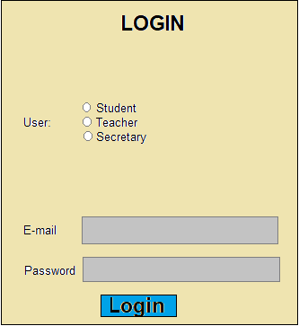
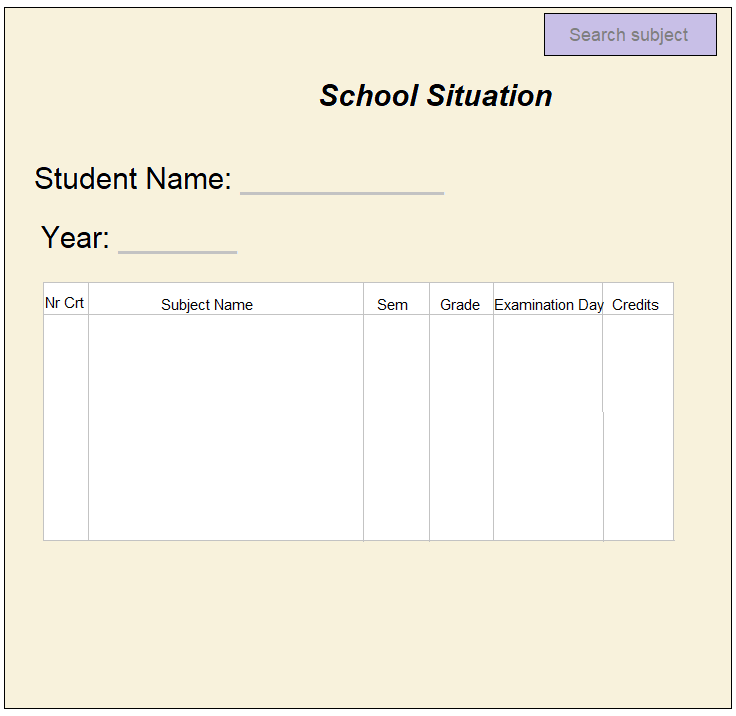

# 1. Introduction
## 1.1 Purpose
The system requirements specification document describes what the Automatic Management of the Students in a Faculty is to do, and how the system will perform each function. 

The audiences for this document include the teachers, the students and the secretaries.
## 1.2 Scope
The application's name will be GASF, from the romanian for Automatic Management of the Students in a Faculty (Gestionarea Automata a Studentilor Facultatii).
This will allow the following actions:
- collect data of the eductaional planifications, study types and their students;
- data management;
- informations supply through a web portal;
- reports generation;
- system interogation;
- management of the documents in the faculty's secretariat.

The main benefit of this application is making students management an easier and safer work, reducing probability of human errors. 
This will be an improvement both for faculty employees and for students.
## 1.3 Definitions, acronyms, and abbreviations
| Name          | Description   |
| ------------- |:-------------:|
|AMSF           | Automatic Management of the Students in a Faculty |
| SRS           | System Requirements Specification                 |
## 1.4 References
| Title         | Link          |
| ------------- |:-------------:|
|IEEE 830       |http://www.math.uaa.alaska.edu/~afkjm/cs401/IEEE830.pdf |
|               |               |
## 1.5 Overview
This document follows the IEEE standard. It has three parts:

##### 1. Introduction 
Information about the scope of the SRS and of the project.

##### 2. Overall Description 
Description of the system.

##### 3. Specific requirements 
Requirements of the software system.

# 2. Overall Description
## 2.1 Product perspective
The app will provide similar functionalities to student records provided by universities. Everything is handeled within the system with no outside dependencies.  
There are multiple types of users that will use the app the likes of which are: students, teachers and university staff, with all of them using the app in different ways.  
The app is hosted on a server and can be accessed by the users on any device, be it computer or smartphone.  
The app will require a SQLServer database to store all present entities.  
The app is hosted on a server and thus it can be accessed remotely from any network.  
On the user's side there are no requirements for using the app. The server on which it is hosted will require enough storage depending on the number of records.  
While all the different types of users accessing the app will interact with some common concepts (Courses, Grades, etc.) the way in which they do will differ greatly.  
The app should be usable on any type of device and not be constrained by screen size or aspect ratio. The app ought to be able to be used by multiple users at the same time without interruptions.  

## 2.2	Product functions

The user interface is accessible through a web site with differentiated and secured access for different user roles and the data from the web site are easy to view and to locate.

The system contains the following modules: the module for data collection, the reporting module, the operations logging module.

A user of the system must be able to register through the web interface. We have three types of users (students, teachers and secretaries) having initially a predefined set of rights, allowing differentiated access to data. The user will be able to make changes, create and generate reports accordingly with the rights allocated.

The data collected by the user will be given through the web interface. The documents can be searched according to the type of file searched, after the date of creation, after the author of the document, after the content of the document.

The data will be displayed on the web page as a table. The user can save them in different formats including PDF.

The system will allow the definition of user groups and the execution of operations at group level (for example: sending emails to all group members).

Data validation will be performed in the module that implements the user interface and will generate error messages, and frequent error cases will suggest ways to resolve them.

## 2.3	User characteristics

The users of this web site are students, teachers and official representatives of a university (secretaries). Each of them have a predefined set of rights, allowing differentiated access to data.

Students use the application to see their academical situation. Each student sees here his grades for each course they took, the credits of that course, the situation of their scholarship, the situation of his college fees.

Teachers use the application to post the grades of their students. Each teacher will have an account where he can see the courses that he is teaching and the students that are taking these classes.

A secretary is an official representative of a university and she is the one that collects information about the students and makes reports with collected information.

## 2.4   Constraints

Constraints, included in Section 2.4 of the SRS, are items that describe any properties that will limit the developers’ options.

Constraints are also sometimes called non­functional requirements because
they are requirements that the system must meet, yet they do not provide or describe functionality that   accomplishes   the   purpose   of   the   system. Design constraints can come in different forms and can influence design decisions in different ways.
There exist other types of constraint such as development resources, technical feasibility, usability and performance. We group these constraints into four categories:

* Requirement Related Constraints - limiting factors from functional requirements that define the scope of a solution design.

* Quality Requirement Related Constraints - limiting factors from quality requirements that define the quality of a solution, e.g. performance
and availability.

* Contextual Constraints – limiting factors that have bearings on the environment for constructing a solution, e.g. project context such as costs and schedule, technology context such as what technology platforms are mandated.

* Solution-related Constraints - limiting factors that arise during the design process. They come
from technical limitations imposed by the chosen design components, e.g. the interface format of a software component.

Therefore, the web applications will be implemented to run on the server side as much as possible. Also, it is required to test the application using different platforms, connection speeds, screen settings, colors/graphics, and browsers.

 1. The system shall be in compliance with all Accessibility, Web Design, and Security Policies applicable.

 2. The system shall use the current corporate standard Microsoft SQL Server database engine.     

 3. Database Design: The database structure should be as complete as possible during the design stage but there should be a room for modification without a large overhaul during later phases.

 4.  Portability: The application codes generated during prototyping may not run properly When re-hosting the data system to a non-Windows OS or transferring the data system to another location.

 5.  As part of standard operating procedures, a testing plan will be documented during the Design phase. The testing plan will be based on user roles, modules or use cases, required tasks and expected outcomes.

 6. The Internet connection is also a constraint for the application. Since the application  etches data from the database over the Internet, it is crucial that there is an Internet connection for the application to function.

## 2.5    Assumptions and dependencies

 1. The users have sufficient knowledge of computers and android devices.

 2. It is assumed that alumni data will be made available for the project in some phase of its completion. Until then, test data will be used for providing the demo for the presentations.

 3. It is assumed that the user is familiar with an internet browser and also familiar with handling the keyboard and mouse.

 4. Since the application is a web based application there is a need for the internet browser. It will be assumed that the users will possess decent internet connectivity.

 5. The users know the English language, as the user interface will be provided in English SMS gateway services for Notification purposes  

 6. The application is used on a computer with enough performance
 ability. If the computer does not have enough performance to support the app's back-end, then there may be scenarios where the application does not work as intended. This could cause performance and usability issues for the user.

# 3. Specific Requirements
## 3.1 External interface requirments
### 3.1.1 User Interfaces
The user interface will be simple and consistent, using terminology commonly understood by the intended users of the system. The system will have a simple interface, consistent with industry standard interfaces.

The user should see the login page, every time he/she tries to connect on the platform. There can be three types of users: student, teacher, secretary.

Every user have a profile page with some important informations about him/ her.

Stdents will have a page with their school situation.

Teachers will have a page with their subjects, and for each of it the groups that have that subject. When the teacher press select, another interface will be opened.

The interface that appears after the teacher press the select button, will be similar with the one in the below picture. Here the teacher introduces students grades.

The secretary can add/ edit students, view students and teachers and generate reports about them.

### 3.1.2 Hardware Interfaces
The system requires an architecture x86 in order to work properly.
### 3.1.3 Software Interfaces
The system will use: 
* ASP.NET Core MVC;
* HTML;
* CSS;
* Microsoft SQL Server. 
### 3.1.4 Communication Interfaces
The system will use HTTP and HTTPS protocols for communication with the web browser.

## 3.3 Performance Requirements
The requirements in this section provide a detailed specification of the user interaction with the softwareand measurements placed on the system performance.

### 3.3.1 Prominent search feature
 
ID: QR1
 
TITLE: Prominent search feature
 
DESCRIPTION: The search feature should be prominent and easy to find for the user.

### 3.3.2 Usage of the search feature
 
ID: QR2

DESCRIPTION: The different search options should be evident, simple and easy to understand (secretary can search students, subjects, teachers etc; students can search teacher, subjects, exams etc; teachers can search students).

### 3.3.3 Usage of the result in the list view 
 
ID: QR3
 
DESCRIPTION: The results displayed in the list view should be user friendly and easy to understand. Selecting anelement in the result list should only take one click.

### 3.3.4 Response time

ID: QR4

DESCRIPTION: The data system shall show no visible deterioration in response time as the number of persons increases. Response times seen by users should be on the order of a few seconds or less.

## 3.4 Design constraints

### 3.4.1 SQL usage

ID: QR5

DESCRIPTION: It is required the usage of Microsoft SQL Server.

### 3.4.2 Number of users

ID: QR6

DESCRIPTION: The  server  shall  be  capable  of  supporting  no  less than 100 concurrent connections.

## 3.5 Software system attributes
The requirements in this section specify the required reliability, availability, scalability and integrability of the software system.

### 3.5.1 Reliability

ID: QR7

DESCRIPTION: The software system should produce a low error rate and should have ability to continue to operate under predefined conditions.

### 3.5.2 Availability

ID: QR8

DESCRIPTION: This is expressed as the ratio of the available system time to the total working time.

### 3.5.3 Scalability

ID: QR9

DESCRIPTION: The system should handle load increases without decreasing performance, or the possibility to rapidly increase the load.

### 3.5.4 Integrability

ID: QR11

DESCRIPTION: Integrability is responsible for system operation and the transmission of data and its exchange with other external systems. The system should be
well-designed, in a way that it facilitates integration with third-party systems.
